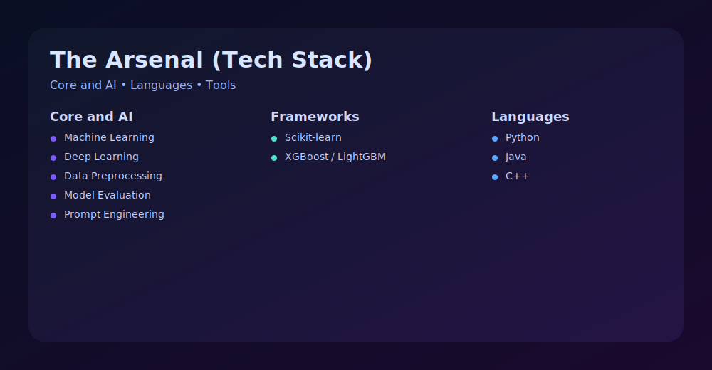
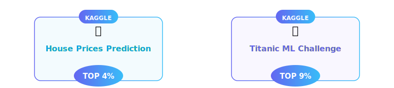
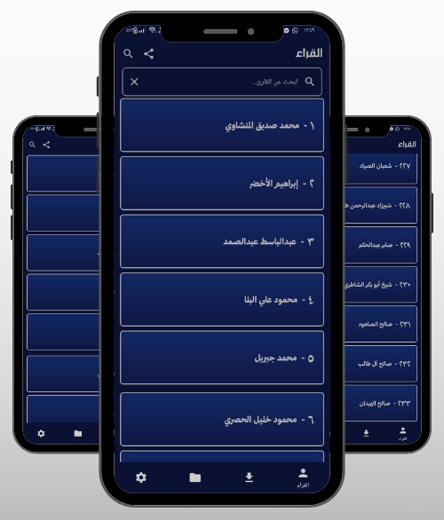

<div align="center">

<!-- Capsule Header -->


<!-- Typing Roles -->


<!-- Typing Animation with Updated Text -->

<br/><br/>

<!-- Animated GIF -->


<br/><br/>


<!-- Social Media Badges with Gradient Colors -->
<p align="center">
  <a href="https://linkedin.com/in/mohamed-faisal-748051360">
    
  </a>
  <a href="https://github.com/mohamed-faisal-salem">
    
  </a>
  <a href="mailto:engmohamedfaisal06@gmail.com">
    
  </a>
  <a href="https://instagram.com/mohamed_faisal.06">
    
  </a>
  <a href="https://kaggle.com/mohamedfaisalsalem">
    
  </a>
</p>

<!-- Profile Views Counter -->
<p align="center">
  
</p>

</div>

<br/>


---

## 💻 About Me

```python
class MohamedFaisal:
    def __init__(self):
        self.name = "Mohamed Faisal"
        self.role = "AI/ML Enthusiast"
        self.education = {
            "university": "Cairo University",
            "faculty": "Faculty of Computers and Artificial Intelligence (FCAI)",
            "year": "Second Year",
            "focus": ["Machine Learning", "Deep Learning", "Natural Language Processing"]
        }
        self.location = "Giza, Egypt 🇪🇬"
        self.languages = ["Arabic (Native)", "English (Intermediate)"]
        
    def current_focus(self):
        return [
            "🤖 Building and experimenting with AI/ML models",
            "📊 Participating in Kaggle competitions",
            "📚 Learning advanced Deep Learning & NLP techniques",
            "🔬 Exploring AI research papers and implementations"
        ]
    
    def achievements(self):
        return {
            "kaggle": {
                "house_prices": "Top 4% 🏆",
                "titanic": "Top 9% 🚢"
            },
            "projects": {
                "ml_models": "Implemented multiple ML/DL models for learning and practice 🧠"
            }
        }
    
    def say_hi(self):
        print("Thanks for visiting! Let's connect and build something amazing together! 🚀")

me = MohamedFaisal()
me.say_hi()
```

<div align="center">

### 💡 *"Passionate about transforming theoretical AI concepts into practical, real-world solutions"*

</div>

---



---

<p align="center">
  
</p>

---




---

<h2 align="center">🚀 Featured Deployment</h2>

<div align="center">
<table>
  <tr>
    <td align="center" width="60%">
      <h3 style="color:#00f2ff">📖 Telawat (Qur’an Recitation App)</h3>
      <p>A sophisticated Android application serving <strong>230+ Reciters</strong> with an elegant UI.</p>
      <p>
        <code>Java</code> <code>XML</code> <code>Firebase</code> <code>Offline Support</code>
      </p>
      <br/>
      <a href="https://github.com/mohamed-faisal-salem/Telawat.git">
        
      </a>
    </td>
    <td align="center" width="40%">
      
    </td>
  </tr>
</table>
</div>

---

<h2 align="center">📜 Certified Intelligence</h2>

<div align="center">
  
  
  
</div>

<br/>
<br/>

<div align="center">
  
</div>
